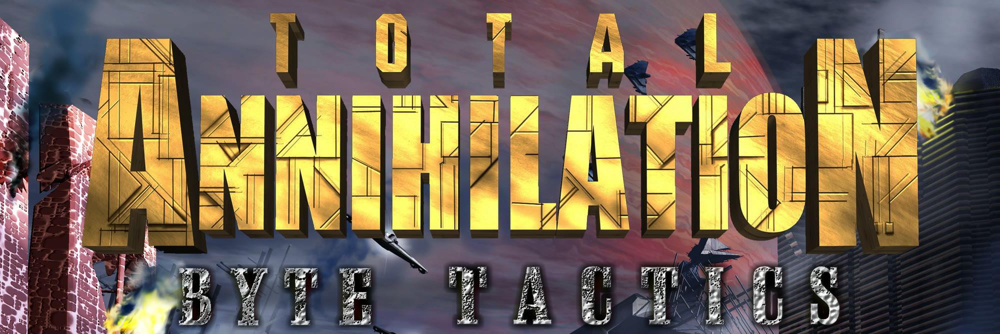

<p align="center">
  
</p>

<p align="center">
  <b>Every function of Total Annihilation, rebuilt in C++ and compiled back to the exact bytes Cavedog shipped.</b>
</p>

<p align="center">
  <a href="https://github.com/HectorBailey/byte-tactics/actions/workflows/build.yml"></a>
  <a href="#building-the-exe"></a>
</p>

<p align="center">
  <a href="#progress">Progress</a> ·
  <a href="#next-steps">Next steps</a> ·
  <a href="#quick-start">Quick start</a> ·
  <a href="#building-the-exe">Building the exe</a> ·
  <a href="#how-a-match-works">How a match works</a> ·
  <a href="#the-target">The target</a> ·
  <a href="#contributing">Contributing</a> ·
  <a href="#legal-and-licence">Legal</a>
</p>

---

## What is this?

**TA: Byte Tactics** is a *matching decompilation* of Total Annihilation
(Cavedog, 1997). The C++ in `src/` is written to compile, with the original
Visual C++ 5.0 compiler, into machine code that is **byte-for-byte identical**
to the game's own `TotalA.exe`. No approximations: if a function is marked
matched, the compiler's output and Cavedog's output are the same bytes.

The matching is complete: all 3,267 game functions match, and the whole exe
builds from source to the shipped bytes. The work now is making that source
easy to read ([next steps](#next-steps)).

> **No game files and no Microsoft software are included.** You bring your own
> copy of Total Annihilation; the setup script fetches the compiler for you.

<!-- progress:start -->
## Progress

**100.00% of Cavedog's code matched** (850,853 of 850,853 bytes)

`[########################################]`

| | Functions | Bytes |
| --- | ---: | ---: |
| Matched byte-for-byte | 3,267 | 850,853 |
| Attempted, not yet matching | 0 | 0 |
| Not attempted yet | 0 | 0 |

### By function size

The size bands are the `size:` labels on the issues.

| Size | Functions matched | Bytes matched | Bytes left | |
| --- | ---: | ---: | ---: | --- |
| small (1 to 64 bytes) | 1,155 of 1,155 | 100.0% | 0 | `##########` |
| medium (65 to 160 bytes) | 827 of 827 | 100.0% | 0 | `##########` |
| large (161 to 400 bytes) | 703 of 703 | 100.0% | 0 | `##########` |
| xl (401 to 600 bytes) | 226 of 226 | 100.0% | 0 | `##########` |
| xxl (601 to 1,000 bytes) | 195 of 195 | 100.0% | 0 | `##########` |
| huge (over 1,000 bytes) | 161 of 161 | 100.0% | 0 | `##########` |

### By area

The linker kept each part of the engine roughly together, so each 64 KB of the
executable is mostly one subsystem. The area names are guesses from the strings
and Windows calls each window's code uses (`data/areas.csv`).

| Addresses | Area | Functions matched | Bytes matched | Bytes left | |
| --- | --- | ---: | ---: | ---: | --- |
| `0x400000` | Unit orders and unit AI | 210 of 210 | 100.0% | 0 | `##########` |
| `0x410000` | Orders and VTOL states | 222 of 222 | 100.0% | 0 | `##########` |
| `0x420000` | Frontend shell | 154 of 154 | 100.0% | 0 | `##########` |
| `0x430000` | Maps, missions, briefings | 228 of 228 | 100.0% | 0 | `##########` |
| `0x440000` | Multiplayer setup | 246 of 246 | 100.0% | 0 | `##########` |
| `0x450000` | Options and audio menus | 176 of 176 | 100.0% | 0 | `##########` |
| `0x460000` | Game and skirmish setup, unit classes | 212 of 212 | 100.0% | 0 | `##########` |
| `0x470000` | Campaign and skirmish screens, resource bars | 259 of 259 | 100.0% | 0 | `##########` |
| `0x480000` | Unit definitions, COB scripting, TNT map | 264 of 264 | 100.0% | 0 | `##########` |
| `0x490000` | Config and registry, skirmish summary | 193 of 193 | 100.0% | 0 | `##########` |
| `0x4a0000` | GUI layout and GAF | 201 of 201 | 100.0% | 0 | `##########` |
| `0x4b0000` | UI controls and file packages | 314 of 314 | 100.0% | 0 | `##########` |
| `0x4c0000` | TDF parser, CD audio, string handles | 298 of 298 | 100.0% | 0 | `##########` |
| `0x4d0000` | Compression (SQSH), CRT/STL, debug, file I/O | 197 of 197 | 100.0% | 0 | `##########` |
| `0x4e0000` | Process exit, psapi | 93 of 93 | 100.0% | 0 | `##########` |

Generated by `uv run tools/progress.py`; per-function status is in `data/progress.csv`.
<!-- progress:end -->

<!-- cleanup:start -->
## Cleanup progress

The matching is done; this is how far the source has got toward reading like source.

**Readability cleanup: about 70% of the way** (mean of the rows with a target)

`[############################------------]`

Counts in `src/` and `include/` at `origin/main`, against `e9367f13` (the roadmap's starting point).

| | Start | Now | Target | Done | |
| --- | ---: | ---: | --- | ---: | --- |
| Source files (`.cpp`) | 2,727 | 304 | 112, one per module (`data/modules.csv`) | 93% | `[###################-]` |
| Placeholder functions `FUN_<addr>` | 1,076 | 282 | 0, named | 74% | `[###############-----]` |
| Placeholder globals `DAT_<addr>` | 737 | 88 | 0, named | 88% | `[##################--]` |
| Placeholder classes `Class_<addr>` | 769 | 673 | 0, named | 12% | `[##------------------]` |
| Placeholder fields `field_<offset>` | 589 | 367 | 0, named | 38% | `[########------------]` |
| Files that define `Unit` | 285 | 80 | 1, one shared definition | 72% | `[##############------]` |
| Files opening with matching history | 301 | 0 | 0, none | 100% | `[####################]` |
| Casts `((T*)x)->` | 1,698 | 320 | 0, casts the types allow | 81% | `[################----]` |
| Byte-offset access `*(T*)(p + off)` and `(char*)p + off` | 1,284 | 640 | cases with no struct | | |

| Cleanup issues | | | |
| --- | --- | --- | ---: |
| Gather issues | 125 of 125 closed | `[####################]` | 100% |
| Join issues | 28 of 31 closed | `[##################--]` | 90% |
| Name issues | 137 of 156 closed | `[##################--]` | 87% |
<!-- cleanup:end -->

## Next steps

Every function matches, but much of the code still reads like a decompiler's
output: placeholder names such as `FUN_004b4ba0` and `DAT_0051e610`, fields
such as `field_9b`, parameters such as `param_1`, and one small file per
function. The goal now is source that reads like a programmer wrote it, without
changing a single byte of the exe (CI checks the MD5 on every change). The
plan is in [docs/tidy-up.md](docs/tidy-up.md):

1. **Folders (done).** Every file sits in a folder for its part of the game
   (`src/units/`, `src/network/`, `src/map/` and so on) and is named after
   its module.
2. **Real names (mostly done).** Functions, classes and globals take real
   names: Cavedog's own wherever the exe keeps them (`HapiBank::OpenBank`, the
   `HAPINET_*` functions, `CMemoryCache`), and otherwise names backed by
   evidence such as the strings a function uses. 2,359 of the 3,267 functions
   have one so far.
3. **Shared types and tidy files (next).** Each file still declares its own
   view of the structures it uses. Next, every type gets one shared
   definition with named fields, the remaining functions, globals, fields and
   variables get readable names, and the one-function files are merged into
   one file per module.

## Quick start

You need `wine`, `7z`, `cabextract`, `curl` and [uv](https://docs.astral.sh/uv/).

```sh
tools/setup_toolchain.sh   # downloads VC++ 5.0 + SP3 into toolchain/, copies TotalA.exe from Steam
```

Set `STEAM_TA` if the game is not in the default Steam library. Then check that
everything works:

```sh
uv run tools/check.py 0x401070      # should print MATCH
```

## Building the exe

With the toolchain set up, the whole game builds from `src/`:

```sh
uv run tools/place.py            # build/place/TotalA.exe, compared byte for byte with orig/TotalA.exe
uv run tools/place.py --no-orig  # the same without reading the original exe
uv run tools/link.py --carve     # an ordinary LINK.EXE build, build/link/TotalA.exe
```

`place.py` compiles every source file with the original compiler and puts each
function and each piece of data at its original address. The result is the
shipped v3.1 exe, byte for byte:

```
MD5 8e74a1dffa1f5988624c52048f5b20cd
SHA-256 3b9c0fadabf3dc67ed5f05a70f1e1505a0c65deadd1a3c930adfe30e2a84995e
```

It takes about a minute on a fast machine. The one input that is not in the
repository is Cavedog's art, the icon and the cursor: `place.py` takes them
from `orig/TotalA.exe`, or from a folder given with `--art DIR` (or
`BT_ART_DIR`) when the original is not there (the MD5 matches only with
Cavedog's own). Without a copy of the game,
`BT_NO_ORIG=1 BT_NO_GHIDRA=1 tools/setup_toolchain.sh` sets up the compiler
alone.

`link.py --carve` links the same objects the ordinary way, so functions land
wherever LINK.EXE puts them and the bytes differ, but that exe plays the game
too (`tools/playtest.py` runs scripted games on both builds).

GitHub Actions builds the exe from source on every change to the code and
fails unless its MD5 is the shipped one (`.github/workflows/build.yml`): the
"Build from source" badge at the top shows the latest run on main, and each
run's summary lists the MD5 and SHA-256 it built.
[docs/linking.md](docs/linking.md) explains how both builds work.

## How a match works

```sh
uv run tools/check.py 0x401070
```

1. Finds the function's file (here `src/game/economy.cpp`, which
   defines `UnitResources::Reset`) and compiles it with `/O2 /Ob2 /MT /Gz`.
2. Extracts the function from the object file.
3. Compares it with the original, ignoring bytes the linker fills in.

It prints `MATCH`, or a similarity score and an assembly diff. The exit code is
0 only on an exact match.

`tools/wcl` runs `cl.exe` under Wine directly (`BT_TOOLCHAIN=msvc5-rtm` selects
the unpatched compiler).

## The target

`TotalA.exe` v3.1 patch, as shipped on Steam (see `orig/TotalA.exe.sha256`).

| Fact | Value | How we know |
| --- | --- | --- |
| Compiler | Visual C++ 5.0 with Service Pack 3 | Linker 5.10; runtime library matches SP3, not RTM (`tools/crtmatch.py`) |
| Runtime library | LIBCMT (static, multithreaded, `/MT`) | 568 LIBCMT code sections found byte-for-byte |
| Compiler flags | `/O2 /Ob2 /MT /Gz`: automatic inlining, no C++ exception handling, `__stdcall` by default | global std::vector initialisers need `/Ob2`; STL code only matches without `/GX`; 2308 of the 2387 game functions with stack arguments clean their own stack (#2290) |
| C++ library | LIBCPMT (`std::string` internals, `_Lockit`, std exceptions) | matched inside the game region; marked `library` |
| Language | C++ | Source paths such as `c:\cavedog\wargame\multi.cpp` in the binary |
| Function map | 3,782 functions with exact start, size and argument count | FPO debug records left in the exe |
| Link date | 1998-07-30 | PE header |

## Repository layout

| Path | What is in it |
| --- | --- |
| `src/` | Reconstructed source, in folders by subsystem (`docs/tidy-up.md`); `uv run tools/sources.py 0x401070` prints the file of a function |
| `data/functions.csv` | Every function in the exe (`tools/functions.py`) |
| `data/modules.csv` | The address ranges of the modules and their folders (`tools/modules.py`) |
| `tools/` | Comparison and analysis scripts |
| `docs/` | Technical guides, and the bugs found in Cavedog's code (`docs/bugs.md`) |
| `orig/` | The original exe (ignored by git) and its expected hash |
| `toolchain/` | VC++ 5.0 and the Wine prefix (ignored by git) |

### The function map

`uv run tools/functions.py` rebuilds `data/functions.csv` from the exe's FPO
records, the runtime library matches and a call graph. Each function has a
`kind`:

- `game`: Cavedog code
- `library`: runtime code, already matched
- `gap`: no FPO record, likely hand-written assembly

### Ghidra

`tools/ghidra.sh` (needs Java 21) loads the exe into Ghidra with that map,
applies the struct layouts and signatures that matched source declares
(`tools/ghidratypes.py`), and exports pseudo-C for every game function to
`build/ghidra/decomp/`.

## Contributing

The functions were handed out as GitHub issues labelled `decomp`, and coding
agents (Claude Code, OpenCode, Codex) worked through them following
`AGENTS.md`: claim an issue, decompile its functions in their own working copy,
and open a pull request. To help, see `CONTRIBUTING.md`; `docs/running-agents.md`
has more on running each tool.

## Legal and licence

This is a preservation and research project. It is not affiliated with or
endorsed by Cavedog Entertainment or Wargaming, who own Total Annihilation.

- **Tooling.** The tooling in `tools/` is MIT licensed (see `LICENSE`).
- **Game code.** The reconstructed code in `src/` is derived from Cavedog's
  work; we claim no rights over it and it is not offered under any licence.
- **Bugs.** Bugs found in the original game are listed in `docs/bugs.md`.
